# multiplexd Internals

This document explains the reference implementation at the level where code is
too local and the specification is too normative: ownership, runtime topology,
cross-file control flow, and invariants.

The protocol contract, wire rules, and interoperability requirements belong in
[spec.md](spec.md). Enum inventories, field layouts, and single-function
mechanics belong in headers and nearby code comments. This file keeps only the
behavior that is hard to reconstruct from one file at a time.

## 1. Scope and Navigation

Use this file for:

- runtime topology across listener, tunnel, session, and stream;
- send and receive paths through queues, buffers, watchers, and timers;
- fairness, backpressure, delayed flush, and resume behavior;
- teardown and late-traffic handling that span multiple modules;
- maintainer-facing invariants that are easy to break during refactors.

Do not use this file for:

- normative protocol rules, frame semantics, or wire compatibility;
- exhaustive API or enum listings;
- field-by-field struct descriptions.

### 1.1 Component Overview

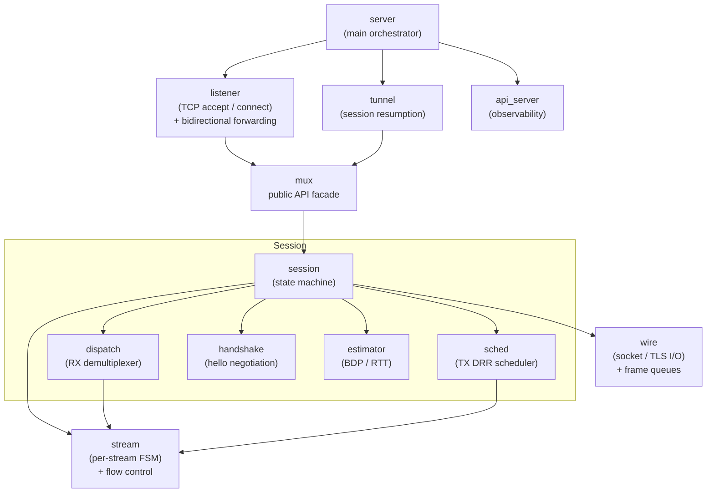

This graph is the ownership map for the rest of the document: listener and
tunnel connect the process to the mux core; session is the coordination
object; dispatch, sched, handshake, estimator, and wire each own one slice of
behavior but coordinate only through session and stream state.

### 1.2 Control Ownership by Subsystem

| Question                                                  | Owning code            |
| --------------------------------------------------------- | ---------------------- |
| Session construction, transport lifecycle, suspend/resume | `mux.c`, `session.c`   |
| Receive parse, stream lookup, namespace checks            | `dispatch.c`           |
| Outbound fairness, control batching, delayed flush        | `sched.c`              |
| Hello parsing, capability latching, resume handshake      | `handshake.c`          |
| Adaptive window growth                                    | `estimator.c`          |
| Reconnect policy, cross-thread relay, top-level ownership | `tunnel.c`, `server.c` |
| Configuration reload sequencing and live drain dispatch   | `server.c`             |

## 2. Ownership Model

The public mux API is intentionally thin. Most entry points schedule or forward
work into session and stream internals rather than owning policy themselves.

| Surface                            | Underlying Behavior                                                                                             |
| ---------------------------------- | --------------------------------------------------------------------------------------------------------------- |
| `mux_new` / `mux_close`            | Construct and finally release the session coordination object, including watchers, queues, and counters wiring. |
| `mux_start` / `mux_attach_fd`      | Choose between accepted-session handshake, outbound connect, or resume re-entry.                                |
| `mux_open_stream` / `mux_stream_*` | Mutate per-stream state, but always under session ownership on one libev loop thread.                           |
| `on_accept`                        | The only admission control point for passive-open streams.                                                      |
| `on_resume`                        | May replace a transient accepted session with a suspended session that steals the new transport.                |
| `MUX_EVENT_CLOSED`                 | Notification only; ownership is released later by `mux_close()`.                                                |

All mux and stream transitions remain single-threaded. The tunnel layer exists
to preserve that invariant when the process hosts multiple sessions; the
threading rules live in §20.

## 3. Runtime State Carriers

| Object  | Owns                                                                                                                                                              | Implicit Consequence                                                                                                                          |
| ------- | ----------------------------------------------------------------------------------------------------------------------------------------------------------------- | --------------------------------------------------------------------------------------------------------------------------------------------- |
| Session | transport fd/TLS state, session sendbuf, fixed receive ring, ctrlbuf, unacked list, retransmit cursor, stream table, ready queue, timers, optional stats pointers | It is the only place where dispatch, sched, handshake, estimator, and wire meet; none of those submodules owns transport state independently. |
| Stream  | send queue, receive ring sized by `recv_window`, flow-control counters, half-close/reset flags, local I/O mode, coalescing membership                             | A stream can be logically closed before it disappears from the table; tombstone retention keeps late traffic deterministic.                   |

State enums are defined in `session.h` and `stream.h`; the diagrams below retain
only the transitions whose runtime coupling is referenced elsewhere in this document.

## 4. State Transition Reference

### 4.1 Session Progression

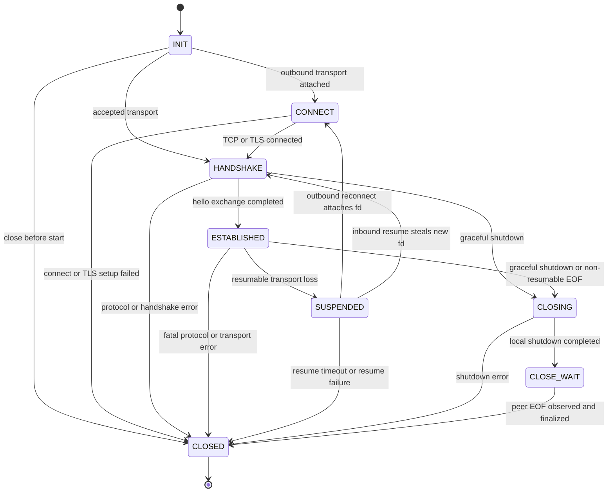

The enum names are less important than the control handoff: outbound reconnect
returns through CONNECT, inbound resume re-enters HANDSHAKE on a different
transport, and terminal `session_reset` skips the suspend path entirely.
Entering `SESSION_SUSPENDED` is observable on both roles: dialed and accepted
sessions both emit `MUX_EVENT_SUSPENDED`, while reconnect policy remains a
tunnel-layer decision.

One additional entry into `SESSION_SUSPENDED` is not shown in the diagram: a
client session (`!accepted`) that has already received a `session_id` from the
server may transition directly from `SESSION_HANDSHAKE` to `SESSION_SUSPENDED`
on transport error. This preserves streams and the unacked list for replay even
if the session was never fully established.

### 4.2 Stream Progression

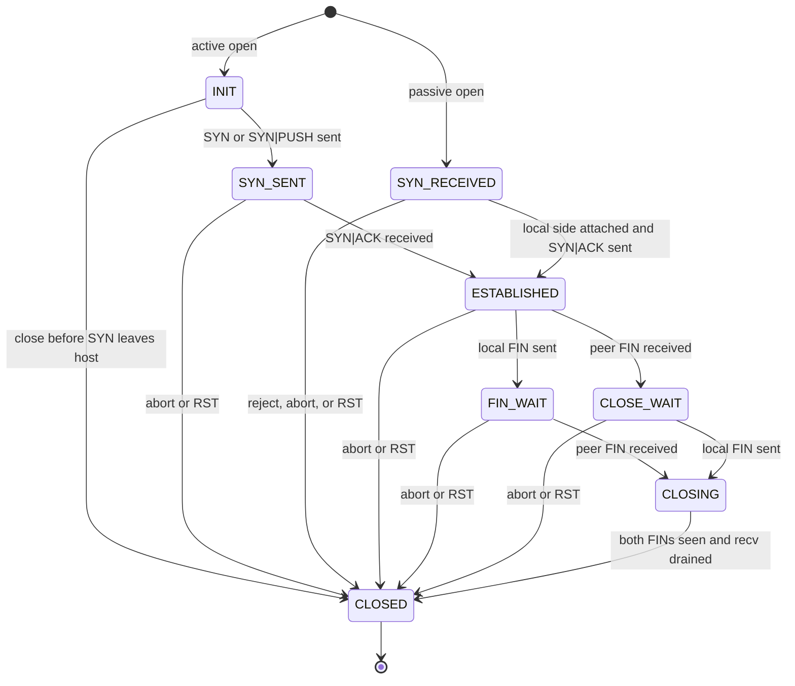

For non-INIT streams, `STREAM_CLOSED` is a protocol-visible tombstone rather
than immediate removal. The delayed-cleanup policy allows dispatch to suppress
duplicate late traffic without maintaining a separate retired-stream map.

The following two sequence diagrams document the scheduler and callback handoffs
at the key state transitions: active open and graceful close.

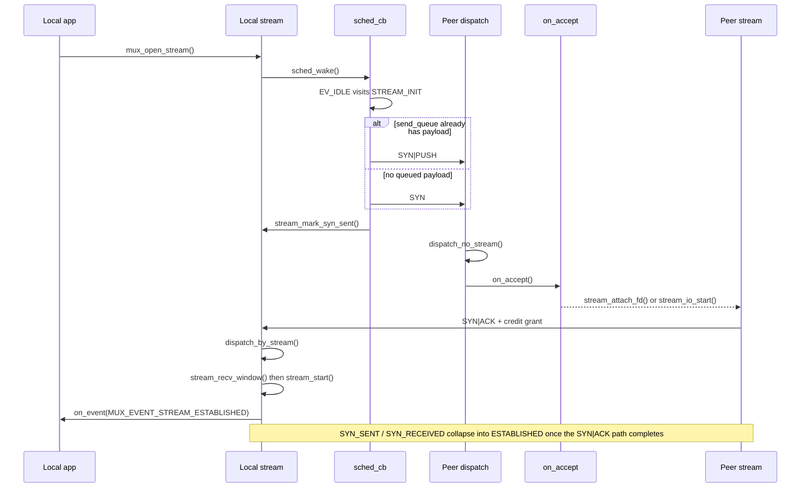

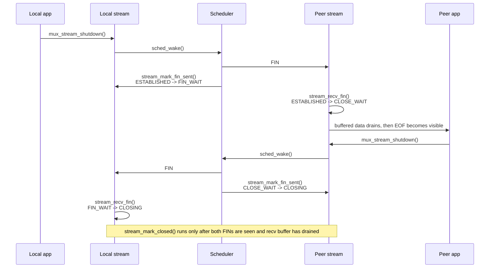

## 5. libev Watcher Topology

| Owner                | Watcher                 | Drives                                               | Runtime Coupling                                                                                                                                                                                                         |
| -------------------- | ----------------------- | ---------------------------------------------------- | ------------------------------------------------------------------------------------------------------------------------------------------------------------------------------------------------------------------------ |
| Session              | `w_socket`              | transport read/write                                 | gated by `rx_open` and `tx_pending` rather than watcher churn                                                                                                                                                            |
| Session              | `w_timeout`             | activity timeout                                     | participates in hard teardown paths                                                                                                                                                                                      |
| Session              | `w_keepalive`           | periodic keepalive scheduling                        | armed only on the steady-state path                                                                                                                                                                                      |
| Session              | `w_send_timeout`        | pending-send stall detection                         | meaningful only while the one-frame sendbuf is pending                                                                                                                                                                   |
| Session              | `w_connect_timeout`     | outbound connection / TLS timeout                    | stops at connect or TLS setup completion; triggers close on expiry                                                                                                                                                       |
| Session              | `w_sched`               | scheduler trigger                                    | bridges lifecycle work into the DRR/send path                                                                                                                                                                            |
| Session              | `w_coalesce`            | delayed ACK / grant / Nagle expiry                   | owns the shared per-stream delay list and deferred session ACK budget                                                                                                                                                    |
| Session              | `w_idle_timeout`        | client idle-close / lazy reconnect                   | feeds the upper-layer reconnect policy                                                                                                                                                                                   |
| Stream (socket mode) | `socket.w_io`           | local fd recv/send pump                              | present only when a real local fd is attached                                                                                                                                                                            |
| Stream (socket mode) | `socket.w_timeout`      | local send/connect stall detection                   | local-edge analogue of session send timeout                                                                                                                                                                              |
| Stream (direct mode) | `direct.w_io`           | synthesized `EV_READ` / `EV_WRITE`                   | user-visible readiness is derived from stream state rather than kernel fd readiness                                                                                                                                      |
| Server               | `w_sighup`              | config reload trigger                                | fires `server_reload()` synchronously on the server loop                                                                                                                                                                 |
| Server               | `w_sigint`, `w_sigterm` | graceful shutdown trigger                            | stops listeners, dispatches `mux_shutdown()` to every tunnel, arms `shutting_down` flag for the `w_maintenance` deadline                                                                                                 |
| Server               | `w_maintenance`         | shutdown deadline, sleep detection, frame-pool drain | fires every second; runs three tasks in priority order: (1) 2 s force-exit when `shutting_down`; (2) wall-clock jump ≥ `mux.timeout` calls `tunnel_drop_transport()` on every tunnel; (3) releases one frame-pool object |
| Server               | `w_async` (threads)     | cross-thread event relay                             | drains the server-side dispatcher queue after tunnel-to-server async relay                                                                                                                                               |

Per-stream coalescing uses `delay_ticks` and `delay_pending` flags instead of
per-stream timers, keeping all delayed-grant state under the single
session-level `w_coalesce` clock.

### 5.1 Watcher Coupling Flags

| Flag            | Purpose                                                                                                                                                                          |
| --------------- | -------------------------------------------------------------------------------------------------------------------------------------------------------------------------------- |
| `rx_open`       | gates `EV_READ` on `w_socket`; cleared on transport EOF or error                                                                                                                 |
| `tx_pending`    | gates `EV_WRITE` on `w_socket`; set when sendbuf or oobbuf has frames to flush; also set by TCP FIN or TLS `close_notify` receipt to wake `send_cb` into the graceful-close path |
| `is_ready`      | marks DRR ready-queue membership                                                                                                                                                 |
| `lp_ready`      | marks low-priority (EV_IDLE lifecycle) queue membership for INIT/CLOSED processing                                                                                               |
| `delay_pending` | marks membership in the shared coalescing delay list                                                                                                                             |
| `nagle_flush`   | one-shot small-frame bypass after a delay-list expiry                                                                                                                            |

## 6. Hello Handshake Processing

The wire format is specified in [spec.md](spec.md); the implementation-specific
part is what the hello changes in runtime state.

| Decision point                        | Implementation consequence                                                                                                                                                                                                                                                |
| ------------------------------------- | ------------------------------------------------------------------------------------------------------------------------------------------------------------------------------------------------------------------------------------------------------------------------- |
| Stream 0 route                        | Hello, keepalive, and session ACK processing bypass the normal stream table.                                                                                                                                                                                              |
| `extensions.reject_inbound`           | Latches `peer_rejects_inbound_streams`, which blocks future active opens.                                                                                                                                                                                                 |
| Initial ClientHello                   | Server assigns the shared `session_id` and completes first-establishment handshake.                                                                                                                                                                                       |
| Resume ClientHello                    | `on_resume` may swap the transient accepted session for a suspended one that steals the new transport and replays unacked frames.                                                                                                                                         |
| ServerHello on the client             | Matching `session_id` + `resume_seq` confirms resume; otherwise the client drops old streams and adopts the new session identity.                                                                                                                                         |
| TLS `close_notify` received on client | Clears `has_session_id`; next reconnect starts a fresh session. Contrast: a plain TCP FIN retains `has_session_id` so resume is attempted. `close_notify` signals an explicit server-side teardown (e.g. version mismatch); a bare TCP FIN may be a dirty transport loss. |
| Handshake completion                  | Fires `MUX_EVENT_ESTABLISHED` or `MUX_EVENT_RESUMED` and re-arms steady-state watchers.                                                                                                                                                                                   |

The two sequence diagrams are kept separate because first establishment and resume
involve different ownership transfers, even though both conclude in the same
steady state.

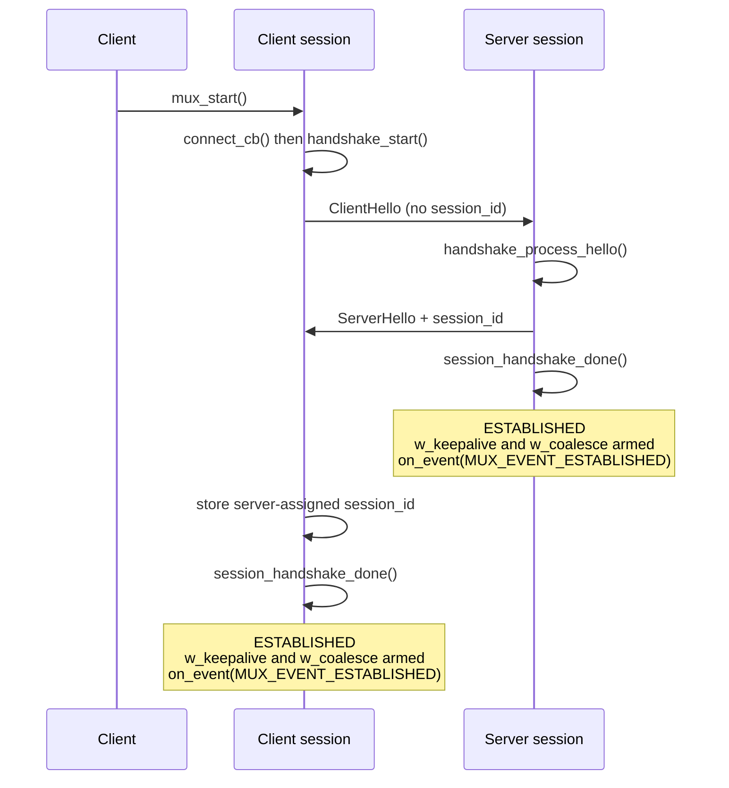

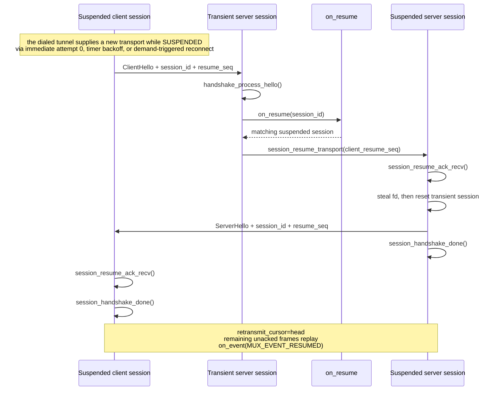

On the normal transport-loss path, both peers have already emitted
`MUX_EVENT_LOST` then `MUX_EVENT_SUSPENDED` before this sequence begins. If the
accepted side has not noticed the break yet, `session_resume_transport()` forces
it through `SESSION_SUSPENDED` before stealing the new fd.

Resume replay may retransmit a prior SYN|ACK for a stream that has already
reached `STREAM_ESTABLISHED` or `STREAM_FIN_WAIT`. `dispatch_by_stream()` detects
this: it silently skips the SYN semantics (no second callback, no state
transition) but still applies the piggybacked ACK credit. This makes retransmit
replay safe even across streams whose opening handshake completed before the
transport was lost.

## 7. Inbound Data Path

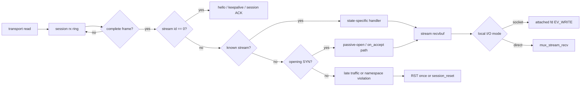

| Design Constraint                                                                                                              | Significance                                                                                      |
| ------------------------------------------------------------------------------------------------------------------------------ | ------------------------------------------------------------------------------------------------- |
| The session keeps one fixed receive ring of `8 * MUX_FRAME_SIZE`; compaction happens only when contiguous tail space runs out. | Receive-side work stays bounded and frame parsing does not imply per-frame allocation.            |
| Unknown non-zero streams split into opening SYN, retired-stream traffic, and namespace violations.                             | Valid late traffic gets one terminal RST; session-level violations still close the whole session. |

## 8. Outbound Data Path

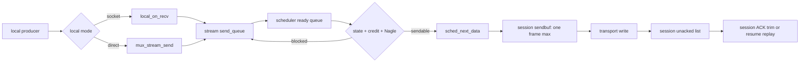

| Design Constraint                                                                                                                                                  | Significance                                                                                                           |
| ------------------------------------------------------------------------------------------------------------------------------------------------------------------ | ---------------------------------------------------------------------------------------------------------------------- |
| Socket-attached reads and `mux_stream_send()` feed the same per-stream send queue.                                                                                 | Local I/O mode does not change fairness or flow-control semantics.                                                     |
| `sched_next_data()` applies state, send credit, and Nagle as one dequeue gate.                                                                                     | A stalled sender can be blocked by any of the three; there is no single “sendable” bit.                                |
| The session sendbuf holds at most one frame at a time.                                                                                                             | Transport backpressure interleaves with scheduling decisions and prevents a hot stream from monopolizing the socket.   |
| `w_send_timeout` matters only while that single frame remains pending.                                                                                             | Send-stall detection tracks transport progress, not queue depth.                                                       |
| `session_eager_flush()` is called from socket-mode `recv_cb()` after reading local data; if no transport I/O is already in flight it inlines `send_cb()` directly. | Avoids one libev event loop iteration on the response path, halving round-trip latency for request/response workloads. |

## 9. Scheduler and Control Batching Internals

### 9.1 Two-Phase Scheduling Model

| Phase                  | Trigger                                            | Work kept here                                                                                       | Why it is split this way                                                                 |
| ---------------------- | -------------------------------------------------- | ---------------------------------------------------------------------------------------------------- | ---------------------------------------------------------------------------------------- |
| `EV_IDLE` (`sched_cb`) | No higher-priority loop work pending               | `STREAM_INIT` SYN / SYN\|PUSH, `STREAM_CLOSED` cleanup                                               | Batches lifecycle work so streams opened in one loop turn can launch together.           |
| `EV_WRITE` (`send_cb`) | Transport became writable or was explicitly nudged | sendbuf flush, retransmit replay, stream-0 out-of-band traffic, new control/data, per-stream ACK/FIN | Interleaves scheduling with socket backpressure instead of producing a long burst first. |

When `send_stalled` is set, `EV_WRITE` stops scheduling fresh payload but still
flushes sendbuf, retransmit traffic, stream-0 control, and per-stream ACK/FIN
so the peer can drain the bottleneck. The `oobbuf` queue (PROBE/PING/PONG
frames) is also exempt from `send_stalled`: the BDP estimator continues to
probe even during window exhaustion, which is exactly when an accurate BDP
reading is most needed.

Retransmit replay sends only PUSH data frames. `session_track_sent()` removes
stream-0 control frames (hello, standalone ACK, keepalive) from the unacked
list immediately after they are flushed to the wire, so they never appear in the
replay sequence. Replaying expired session-management traffic to a resumed peer
with fresh session state would be a protocol error.

### 9.2 Ready Queue Fairness Model (DRR)

| Step | Action                                                                                                                        |
| ---- | ----------------------------------------------------------------------------------------------------------------------------- |
| 1    | Use `drr_active` if present; otherwise dequeue the next ready stream.                                                         |
| 2    | On the first dequeue of the stream in a round, add one quantum (`MUX_MAX_PAYLOAD_SIZE`) to `deficit`.                         |
| 3    | Send one PUSH frame and subtract its payload length from `deficit`.                                                           |
| 4    | If the next queued frame still fits in `deficit`, keep the stream in `drr_active`; otherwise re-enqueue it after `round_end`. |
| 5    | Reset `deficit` when the stream drains; emit pending ACK/FIN after payload selection.                                         |

| Mechanism                        | Invariant                                                                                                       |
| -------------------------------- | --------------------------------------------------------------------------------------------------------------- |
| `round_end`                      | Streams re-enqueued during the current round wait until the next round.                                         |
| `drr_active`                     | One stream may consume the rest of its quantum without a dequeue/re-enqueue round trip.                         |
| Quantum = `MUX_MAX_PAYLOAD_SIZE` | Fairness is by bytes, not frames: many 100-byte frames and one 16 KiB frame get the same byte budget per round. |

### 9.3 Control Packing and Tombstones

| Mechanism        | Rule                                                                                            | Rationale                                                                                                          |
| ---------------- | ----------------------------------------------------------------------------------------------- | ------------------------------------------------------------------------------------------------------------------ |
| `ctrlbuf`        | Pack control-only headers in 8-byte units; flush to sendbuf when full.                          | Standalone ACK, FIN, RST, and keepalive traffic share one batching path.                                           |
| Tombstone linger | Non-INIT streams remain in the table for `MUX_TOMBSTONE_PERIOD_S` after `stream_mark_closed()`. | Dispatch can suppress duplicate late traffic and answer at most one final RST without a second retired-stream map. |
| INIT fast close  | Streams closed before a SYN leaves skip tombstone retention.                                    | The peer never observed the stream id, so there is no late-traffic state to preserve.                              |

## 10. Flow-Control Bookkeeping and Backpressure


### 10.1 Counter Roles

| Counter set                     | Meaning                                                          | Implicit Invariant                                                                           |
| ------------------------------- | ---------------------------------------------------------------- | -------------------------------------------------------------------------------------------- |
| `send_window`, `bytes_sent`     | cumulative peer grant vs cumulative payload sent                 | Send credit is tracked cumulatively; the implementation does not reason in per-frame grants. |
| `queued_send_bytes`             | payload accepted from the local producer but not yet transmitted | Read credit subtracts queued bytes as well as transmitted bytes.                             |
| `unacked_bytes`                 | in-flight payload associated with pending peer acknowledgement   | Coalescing and delayed-ACK logic cares about bytes already emitted, not just queue depth.    |
| `recv_window`, `buffered_bytes` | receive budget vs receive memory currently occupied              | Memory pressure scales grants without rewriting already-buffered data.                       |
| `grant_sent`, `bytes_received`  | already-advertised receive credit vs cumulative bytes delivered  | The next grant is derived from the delta, not from current buffer occupancy alone.           |

The most subtle gate is `stream_read_credit_avail()`: local socket reads stop
when `queued_send_bytes + bytes_sent` would exceed peer credit, so the sender
cannot over-admit data into `send_queue`.

On the receive side, `stream_recv_copy()` tolerates up to one
`MUX_MAX_PAYLOAD_SIZE` of inbound data beyond `recv_window`. Credit is issued
in `MUX_WINDOW_UNIT` chunks, so a peer may have slightly more credit outstanding
than the current window value; the tolerance absorbs this quantization instead
of triggering a spurious `FLOW_CONTROL_ERROR`.

### 10.2 Critical Gating Rule

| Gate                  | Trips when                                                                                                                                | Consequence                                                                                                                        |
| --------------------- | ----------------------------------------------------------------------------------------------------------------------------------------- | ---------------------------------------------------------------------------------------------------------------------------------- |
| Read credit           | `queued_send_bytes + bytes_sent >= send_window`                                                                                           | Local socket reads stop before the peer grant is exhausted.                                                                        |
| Session send stall    | unacked list reaches `session_window` frames                                                                                              | `EV_WRITE` stops scheduling fresh payload but still flushes sendbuf, retransmit traffic, stream-0 control, and per-stream ACK/FIN. |
| Expressible grant     | newly grantable credit is at least one `MUX_WINDOW_UNIT`                                                                                  | `ack_pending` becomes meaningful only once the wire can represent the increment.                                                   |
| Immediate ACK / grant | `quickack_budget > 0`, or grantable credit reaches `2 * MUX_MAX_PAYLOAD_SIZE`, or `recv_seq - ack_seq >= clamp(session_window / 4, 2, 8)` | The implementation bypasses delayed ACK so both peers do not wait on each other's timers.                                          |

`session_ack_trim()` clears `send_stalled` and nudges the scheduler only after a
session ACK shrinks the unacked list below the cap.

### 10.3 ACK Grant Triggering

Grants follow three paths:

| Path                  | Condition                                                                    | Wire shape                                                                              |
| --------------------- | ---------------------------------------------------------------------------- | --------------------------------------------------------------------------------------- |
| Immediate             | `quickack_budget > 0` or grantable credit reaches `2 * MUX_MAX_PAYLOAD_SIZE` | Piggyback in the next data frame when possible; otherwise emit a standalone ACK header. |
| Delayed per-stream    | grant is expressible but does not meet the immediate threshold               | Put the stream on the coalescing delay list and flush on the next coalescing tick.      |
| Immediate session ACK | `recv_seq - ack_seq >= clamp(session_window / 4, 2, 8)`                      | Emit a session ACK immediately to relieve session-wide backpressure.                    |

### 10.4 Receive-Buffer Pressure and Auto Window

For `x = recv_buffered_bytes`, the receive-pressure scale is:

- `scale(x) = 1` for `x < s_lo`;
- `scale(x)` falls linearly from `1` to `1/8` for `s_lo <= x < s_hi`;
- `scale(x) = 1/8` for `x >= s_hi`.

`stream_grant_inc()` applies that scale and then enforces a one-unit floor for
any non-zero expressible grant, so receive pressure can slow credit growth but
cannot starve a live stream forever.

Automatic mode is opt-in per direction: `stream_window = 0` in config enables
`auto_stream_window` (BDP estimator drives the per-stream receive window;
see §12), and `session_window = 0` enables `auto_session_window` (session cap
mirrors `peer_stream_window` on each SYN/SYN|ACK).  Either field may be auto
without the other.  In auto mode the affected cap starts at
`MUX_INITIAL_SEND_WINDOW / MUX_WINDOW_UNIT` frames; when the session cap is
reached, `send_stalled` throttles payload scheduling rather than closing the
session.

## 11. Delayed ACK and Coalescing Timer Behavior

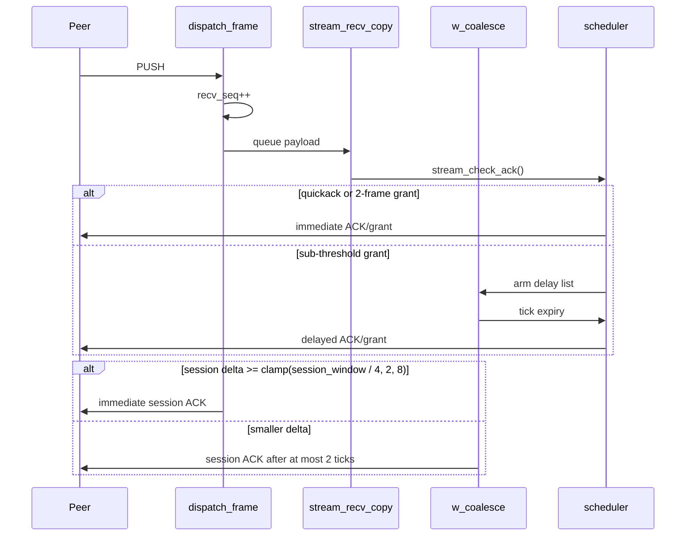

One session-level timer, `w_coalesce`, serves both delayed-grant paths:

| Mechanism             | Arm condition                                             | Bound                                       | Effect on expiry                                                                                  |
| --------------------- | --------------------------------------------------------- | ------------------------------------------- | ------------------------------------------------------------------------------------------------- |
| Per-stream coalescing | stream placed on the delay list with `delay_ticks`        | `delay_ticks * 40 ms`                       | remove from the list, set one-shot `nagle_flush`, apply pending grant, and enqueue for scheduling |
| Deferred session ACK  | `recv_seq - ack_seq` stayed below the immediate threshold | `MUX_SESSION_ACK_MAX_TICKS * 40 ms` = 80 ms | emit a session ACK so the peer can trim its unacked list                                          |

This timer is shared, not per-stream. It starts after handshake completion,
restarts after resume handshake completion, and is stopped only when the
session leaves the steady-state path.

## 12. BDP Estimator

The estimator is active when `stream_window = 0` in config (`auto_stream_window`
mode). It learns a byte-domain BDP from inbound payload-driven probe cycles and
sets `stream_window` so the mux credit window is never the throughput
bottleneck.  TCP handles congestion control; the estimator only ensures the
per-stream receive window stays ahead of the BDP.  `session_window` is driven
independently by `session_update_session_window` whenever a SYN or SYN|ACK
arrives (when `session_window = 0` in config, i.e., `auto_session_window` mode);
the two modes are fully independent.

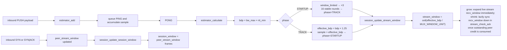

### 12.1 Core Equations

`session_update_stream_window` converts `effective_bdp` to frames with
**ceiling** division, so even a 1-byte headroom translates to at least one
extra frame.

```text
bw_sample      = sample × 1e9 / rtt_ns
bw_max         = wndfilter_max(bw_wnd, WND_BW_MAX_NS)     -- 86400 s window
rtt_min_ns     = wndfilter_min(rtt_wnd, WND_RTT_MIN_NS)   -- 600 s window
bdp            = bw_max × rtt_min_ns / 1e9
window_limited = sample + sample/2 > effective_bdp        -- sample > 2/3 target

-- STARTUP phase (bw_max == 0 → no-op)
if window_limited:
    effective_bdp ×= 3 (capped at WNDSIZE_MAX); stable_rounds = 0
else:
    stable_rounds++
    if stable_rounds >= STARTUP_STABLE_ROUNDS:
        phase = TRACK

-- TRACK phase
effective_bdp  = bdp + bdp / 4
if sample > effective_bdp:  phase = STARTUP; stable_rounds = 0

initial_frames = MUX_INITIAL_SEND_WINDOW / MUX_WINDOW_UNIT
stream_window  = max(ceil(effective_bdp / MUX_WINDOW_UNIT), initial_frames)
```

The `bw_wnd` 86400 s window and `rtt_wnd` 600 s window together act as a
natural floor: a measured peak bandwidth and minimum RTT persist for up to
their respective window sizes before `effective_bdp` can fall materially
below the level it once supported.

Constants: `WNDSIZE_MAX = UINT16_MAX × MUX_WINDOW_UNIT`, `WNDSIZE_MIN = 4 × MUX_WINDOW_UNIT`, `STARTUP_STABLE_ROUNDS = 16`, `WND_BW_MAX_NS = 86400 s`, `WND_RTT_MIN_NS = 600 s`, `MUX_PING_RATE_LIMIT_NS = 1 s`.

### 12.2 Probe Lifecycle

| Event                                                      | Effect                                                                                                                                                                                           |
| ---------------------------------------------------------- | ------------------------------------------------------------------------------------------------------------------------------------------------------------------------------------------------ |
| First inbound PUSH with no probe in flight                 | Start `sample = bytes`, queue PING with `last_probe_ns` payload, set `ping_in_flight`.                                                                                                           |
| More eligible PUSH while PING is in flight                 | Accumulate payload into `sample`; no static clamp — overflow guard applied during `bw_sample` calculation.                                                                                      |
| `now − last_probe_ns < MUX_PING_RATE_LIMIT_NS`             | Rate limit applies in every phase: skip without starting a probe; at most one cycle per `MUX_PING_RATE_LIMIT_NS` (1 s).                                                                          |
| PING timeout (≥ `conf.ping_timeout` since `last_probe_ns`) | Discard the cycle; suspend the session for resume if `has_session_id`, otherwise close it via `session_notify_closed`; `last_probe_ns` is not updated; no new probe is started on the same call. |
| Matching PONG (`sent_ns == last_probe_ns`)                 | `estimator_calculate` updates RTT/BW filters and `effective_bdp` per §12.3; advances `last_probe_ns` to gate the next probe.                                                                     |
| Stale PONG (`sent_ns != last_probe_ns`)                    | Discarded without updating any filter.                                                                                                                                                           |
| Liveness PING via `estimator_ping`                         | Bypasses the data-driven trigger; queues a PING with `last_probe_ns` current time and sets `ping_in_flight` (no-op when a probe is already in flight).                                           |

The estimator has no dedicated timer; probes are driven by payload arrival and
are completed either by a matching PONG or by timeout detection on the next
PUSH.

### 12.3 `effective_bdp` Update Rules

Each valid PONG updates `rtt_wnd` (windowed-minimum RTT) and `bw_wnd` (windowed-maximum
bandwidth); a zero sample cannot raise the bandwidth peak.  `bdp` is computed
directly as `bw_max × rtt_min_ns / 1e9` without a separate BDP filter.
`effective_bdp` is then adjusted according to the current phase (`STARTUP` or
`TRACK`), stored in `est->phase`.

**STARTUP phase** — fast-start, searching for the bandwidth ceiling:

- **window_limited** (`sample > 2/3 × effective_bdp`): the receive window is the
  throughput bottleneck; triple `effective_bdp` (capped at `WNDSIZE_MAX`) and
  reset `stable_rounds` to 0.
- **otherwise**: increment `stable_rounds`; once it reaches
  `STARTUP_STABLE_ROUNDS` (16) consecutive non-window-limited cycles, the window
  is confirmed to have headroom — transition to TRACK.
- `bw_max == 0` (no bandwidth sample yet): `effective_bdp` is unchanged and
  `stable_rounds` is not advanced.

**TRACK phase** — steady-state, tracking the current BDP:

- **Always**: `effective_bdp = bdp + bdp / 4`, where `bdp = bw_max × rtt_min_ns / 1e9`.
- **Sample exceeds target** (`sample > effective_bdp`): link bandwidth has
  improved — re-enter STARTUP and reset `stable_rounds` to 0.  `effective_bdp`
  is not reset; STARTUP resumes growing from the current TRACK value if the
  window is still the bottleneck.

### 12.4 Window Update and Lifecycle

| Event                            | Result                                                                                                                                                                                                                                                                                                                                      |
| -------------------------------- | ------------------------------------------------------------------------------------------------------------------------------------------------------------------------------------------------------------------------------------------------------------------------------------------------------------------------------------------- |
| Manual mode                      | The estimator is inert; configured frame counts are used as-is.                                                                                                                                                                                                                                                                             |
| Automatic `stream_window`        | `auto_stream_window = true`; effective `stream_window` starts at `initial_frames` and grows with `effective_bdp`; the `bw_wnd` 86400 s window buffers shrinks—`effective_bdp` cannot fall below the level it once supported until the old peak ages out.                                                                                    |
| Automatic `session_window`       | `auto_session_window = true`; `session_window` starts at `initial_frames` and is updated from `peer_stream_window` on each SYN/SYN\|ACK.                                                                                                                                                                                                    |
| `session_update_stream_window()` | `stream_window` is set to `max(ceil(effective_bdp / MUX_WINDOW_UNIT), initial_frames)`; live streams expand `recv_window` immediately on grow; on shrink, each stream's `recv_window` is lazily synced down by `stream_check_ack` once `buffered_bytes + outstanding ≤ target`.                                                             |
| Disconnect / stop                | `stream_window` is set to `max(effective_bdp / 2 / MUX_WINDOW_UNIT, initial_frames)` without modifying the estimator struct. The learned RTT and bandwidth filters are preserved across reconnects; any stale in-flight probe is detected by the timeout path on the next inbound PUSH, which closes or suspends the session at that point. |
| First enter auto mode on reload  | `estimator_init()` seeds `effective_bdp` from the current `stream_window * MUX_WINDOW_UNIT` and zeroes the rest of the estimator state.  Subsequent reloads that stay in auto mode preserve the learned state.                                                                                                                              |

When `stream_window` decreases (TRACK trim to `bdp + bdp/4`, or manual reload), each
stream's `recv_window` is lazily synced to the new target inside
`stream_check_ack`: the shrink is applied as soon as
`buffered_bytes + outstanding ≤ target` (`outstanding = grant_sent − bytes_received`),
so the peer is never asked to respect a limit below what it has already been
granted.

## 13. Two Local I/O Modes

| Mode            | Local readiness source                                           | Outbound producer                             | Inbound consumer                        | Watchers                          |
| --------------- | ---------------------------------------------------------------- | --------------------------------------------- | --------------------------------------- | --------------------------------- |
| Socket-attached | kernel fd readiness                                              | attached-fd `EV_READ` pumps into `send_queue` | attached-fd `EV_WRITE` drains `recvbuf` | `socket.w_io`, `socket.w_timeout` |
| Direct          | `mux_stream_io_modify()` synthesises readiness from stream state | `mux_stream_send()`                           | `mux_stream_recv()`                     | `direct.w_io`                     |

Both modes share the same queues, counters, ACK logic, and close semantics; the
only difference is how the local application edge is driven.

## 14. Error Handling and Reset Semantics

The wire rules live in [spec.md](spec.md#534-abrupt-shutdown). This section
keeps only the implementation-side reset path, late-traffic handling, and the
conditions that still escalate to whole-session failure.

### 14.1 Session-Fatal Conditions

| Trigger                            | Session-side result                                  |
| ---------------------------------- | ---------------------------------------------------- |
| Parse failure or transport failure | `session_reset()` → `SESSION_CLOSED`; non-resumable. |

### 14.2 Stream Abort Behavior

| Step                | Effect                                                                                                                                            |
| ------------------- | ------------------------------------------------------------------------------------------------------------------------------------------------- |
| `stream_abort()`    | sends or schedules reset signaling, clears unsent data, discards buffered receive data, and closes stream state immediately                       |
| Stale-control purge | queued control headers for the same stream are removed before the reset path commits, so obsolete ACK/FIN traffic cannot precede the terminal RST |

### 14.3 RST Transmission and Unknown-Stream Handling

| Case                                               | Implementation result                                                                                                                                |
| -------------------------------------------------- | ---------------------------------------------------------------------------------------------------------------------------------------------------- |
| Local live stream is aborted                       | discard stale queued non-RST frames for that stream, queue one RST with the chosen status, and transition the local stream state immediately         |
| Unknown-stream inbound RST                         | ignore it                                                                                                                                            |
| Retired-stream zero-length ACK or FIN              | ignore it                                                                                                                                            |
| Unknown-stream opening SYN                         | admit it through the passive-open path                                                                                                               |
| Valid non-SYN frame for an unknown non-zero stream | treat it as late traffic for a retired stream id, emit one terminal RST, remember that the id was already reset, then drop later duplicates silently |
| Late frame for an already closed live stream       | drop it in `dispatch_by_stream()` without reopening stream state                                                                                     |

This split keeps the session alive during stream teardown while still informing
the peer that the stream id is no longer live.

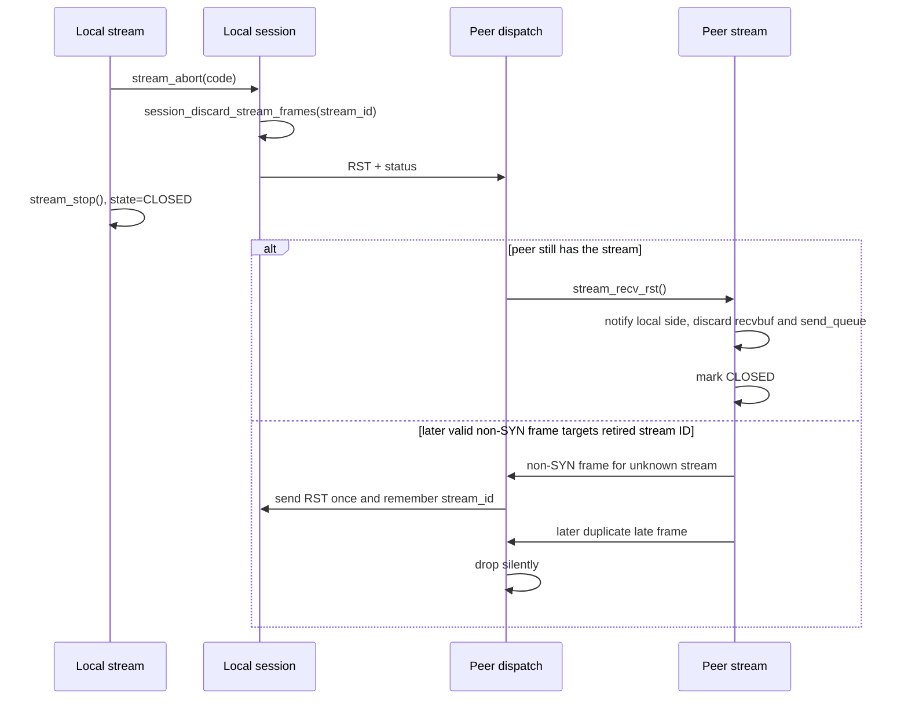

### 14.4 Session-Fatal Namespace Violations

`dispatch_no_stream()` escalates to `session_reset()` only when the received
frame breaks session-level namespace invariants rather than merely targeting a
retired stream id.

| Violation                               | Why it is session-fatal                                                                                                               |
| --------------------------------------- | ------------------------------------------------------------------------------------------------------------------------------------- |
| Invalid opening SYN flags               | an unknown stream may start only with `SYN` or `SYN \| PUSH`; anything else breaks the namespace before stream allocation even begins |
| Stream-id parity violation              | the peer used a stream id that is not legal for its endpoint role                                                                     |
| Reserved flag bits on an unknown stream | the frame is invalid at the session namespace boundary, not just at one stream                                                        |

These cases close the whole session immediately. They never enter
`SESSION_SUSPENDED`, so they are not resumable. Valid late non-SYN traffic for
a retired stream is handled by the single-RST path in Section 14.3 instead.

## 15. Teardown, Reconnect, and Idle Policies

| Situation                                                                           | Policy owner  | Outcome                                                                                                                                                                                                                |
| ----------------------------------------------------------------------------------- | ------------- | ---------------------------------------------------------------------------------------------------------------------------------------------------------------------------------------------------------------------- |
| Session teardown                                                                    | session layer | stop watchers first, then deep cleanup, then close transport, then hand control back to reconnect policy if applicable                                                                                                 |
| Resumable transport loss                                                            | session layer | enter `SESSION_SUSPENDED`, arm the resume timer, and emit `MUX_EVENT_SUSPENDED` on both dialed and accepted sessions                                                                                                   |
| Wall-clock jump ≥ `mux.timeout` detected by `maintenance_cb`                        | server layer  | `tunnel_drop_transport()` shuts down the transport fd for every active tunnel; each session detects the loss via `MUX_EVENT_LOST` and `MUX_EVENT_SUSPENDED`; client tunnels re-dial via the normal transport-loss path |
| Dirty transport loss on a dialed tunnel with `idle_timeout == 0`                    | tunnel layer  | take immediate reconnect attempt 0 via `handle_transport_lost()` / `tunnel_do_connect()`                                                                                                                               |
| Dirty transport loss on an accepted tunnel                                          | tunnel layer  | observe `MUX_EVENT_SUSPENDED`, but do not start an outbound reconnect; wait for peer resume or timeout                                                                                                                 |
| Attempt 0 failed, or reconnect triggered from `MUX_EVENT_CLOSED` on a dialed tunnel | tunnel layer  | fall back to `tunnel_schedule_reconnect()` starting at 0.2 s and increment `reconnect_count`                                                                                                                           |
| Successful `MUX_EVENT_ESTABLISHED` or `MUX_EVENT_RESUMED` on a dialed tunnel        | tunnel layer  | reset `reconnect_count` to 0                                                                                                                                                                                           |
| Client idle timeout enabled                                                         | tunnel layer  | suppress attempt 0 and automatic CLOSED-time backoff; reconnect becomes demand-triggered from `open_stream_task()`                                                                                                     |
| Stream-id exhaustion                                                                | session layer | `session_open_stream()` returns `NULL`; session stays up and the caller retries after old streams leave the parity space                                                                                               |

### 15.1 Inbound Session Admission Control

The mux listener applies a three-layer guard (`is_startup_limited()`) before
creating an accepted tunnel:

| Layer | Config field                                 | Behavior                                                                                                                                                                                                             |
| ----- | -------------------------------------------- | -------------------------------------------------------------------------------------------------------------------------------------------------------------------------------------------------------------------- |
| 1     | `max_sessions`                               | Hard cap on fully established sessions; excess connections are rejected immediately.                                                                                                                                 |
| 2     | `startup_limit_full`                         | Hard cap on half-open sessions; protects against SYN-flood-style connection floods.                                                                                                                                  |
| 3     | `startup_limit_start` / `startup_limit_rate` | Probabilistic shedding: once half-open count exceeds `startup_limit_start`, new connections are admitted with probability `1 − startup_limit_rate`. Provides graceful load reduction before the hard cap is reached. |

## 16. Implementation Invariants for Maintainers

| Invariant                                                                                                                      | Significance                                                                                                                                                        |
| ------------------------------------------------------------------------------------------------------------------------------ | ------------------------------------------------------------------------------------------------------------------------------------------------------------------- |
| Scheduler cycle tail capture preserves the fairness boundary.                                                                  | Re-enqueued streams must not slip back into the current round.                                                                                                      |
| Read credit subtracts `queued_send_bytes` as well as transmitted bytes.                                                        | The local producer must not outrun peer credit by filling `send_queue` ahead of the wire.                                                                           |
| `nagle_flush` is one-shot.                                                                                                     | Delay expiry bypasses Nagle once, then normal gating resumes.                                                                                                       |
| Reset paths purge stale control before queuing RST.                                                                            | Obsolete ACK/FIN traffic must not precede the terminal reset.                                                                                                       |
| Cumulative counters rely on wrapping arithmetic.                                                                               | ACK, grant, and replay bookkeeping are expressed in cumulative domains rather than one-shot deltas.                                                                 |
| Stream 0 carries control traffic only.                                                                                         | Control routing must stay isolated from ordinary stream dispatch.                                                                                                   |
| `session_ack_trim()` treats `last_ack_recv` as cumulative; the session-ACK Extra field is an increment, not an absolute value. | Session ACK trim logic depends on cumulative progress, not on an echoed absolute sequence number.                                                                   |
| After `session_resume_transport()`, `retransmit_cursor` must point to the unacked-list head.                                   | Resume replay must start with the oldest unacked frame before any new traffic is enqueued.                                                                          |
| `recv_seq` is incremented before the per-stream handler runs.                                                                  | For sessions that survive, this matches the spec's processed-frame count; for frames that trigger `session_reset()`, the incremented value is never observed again. |

## 17. Source Map (Implementation)

| Concern                                                                            | Files                                                                                        |
| ---------------------------------------------------------------------------------- | -------------------------------------------------------------------------------------------- |
| API wrappers and public entry points                                               | [src/mux/mux.c](../src/mux/mux.c), [src/mux/mux.h](../src/mux/mux.h)                         |
| Session state machine, transport lifecycle, suspend/resume                         | [src/mux/session.c](../src/mux/session.c), [src/mux/session.h](../src/mux/session.h)         |
| BDP/RTT estimator                                                                  | [src/mux/estimator.c](../src/mux/estimator.c), [src/mux/estimator.h](../src/mux/estimator.h) |
| Stream queues, local I/O modes, half-close/reset behavior, flow-control accounting | [src/mux/stream.c](../src/mux/stream.c), [src/mux/stream.h](../src/mux/stream.h)             |
| Frame header coding and frame-list helpers                                         | [src/mux/frame.c](../src/mux/frame.c), [src/mux/frame.h](../src/mux/frame.h)                 |
| Hello JSON encoding/parsing and handshake transitions                              | [src/mux/handshake.c](../src/mux/handshake.c), [src/mux/handshake.h](../src/mux/handshake.h) |
| Inbound frame dispatch and stream-level protocol validation                        | [src/mux/dispatch.c](../src/mux/dispatch.c), [src/mux/dispatch.h](../src/mux/dispatch.h)     |
| Ready-queue fairness, EV_IDLE lifecycle scheduling, coalescing timer               | [src/mux/sched.c](../src/mux/sched.c), [src/mux/sched.h](../src/mux/sched.h)                 |
| Raw transport send/recv and shared session buffer ownership transitions            | [src/mux/wire.c](../src/mux/wire.c), [src/mux/wire.h](../src/mux/wire.h)                     |

## 18. Counters Architecture

Aggregate counters are owned by the server and written through pointer blocks so
session hot paths never need to know the owning struct.

| Piece                         | Implementation rule                                                                                                                   |
| ----------------------------- | ------------------------------------------------------------------------------------------------------------------------------------- |
| `session_counters`            | `mux.h` stores pointers into the server's flat counters; pointer types are atomic under `WITH_THREADS` and plain otherwise.           |
| Traffic subgroup              | `traffic` groups `byt_mux_recv`, `byt_mux_sent`, `byt_local_recv`, and `byt_local_sent` to mirror the flat `server_stats` layout.     |
| Update path                   | Sessions write counters directly through `COUNTER_ADD`; there is no snapshot aggregation phase.                                       |
| Stream-establish latency ring | `server_stats` keeps a fixed 256-entry ring and a monotonic counter; samples are written eagerly on `MUX_EVENT_STREAM_ESTABLISHED`.   |
| Read path                     | All aggregate reads go through `server_stats()`; per-session diagnostics are delivered by `on_event`, not by polling session objects. |

## 19. Identity Extension

The extension format is defined in [spec.md](spec.md); the implementation value
is that identity becomes a routing key.

| Item                                | Implementation note                                                                                            |
| ----------------------------------- | -------------------------------------------------------------------------------------------------------------- |
| Hello payload                       | When configured, hello carries `extensions.identity = <claimed-id>` from `mux_session_opts.identity`.          |
| Latched state                       | The peer's identity is stored in `handshake_ctx.peer_identity` for the session lifetime.                       |
| Server-side routing                 | Accepted sessions are wired to the matching service listener by peer identity.                                 |
| Client-side routing                 | `handle_connected()` maps the peer identity returned in `ServerHello` to the matching `identity.listen` entry. |
| Config role: `identity.claim`       | local node identity, sent in every hello                                                                       |
| Config role: `identity.mux_connect` | one outbound mux session per entry                                                                             |
| Config role: `identity.listen`      | local listener keyed by peer identity                                                                          |
| Inbound mux streams                 | always forward to the root `connect` target regardless of advertised peer identity                             |

In client mode, one mux session per `identity.mux_connect` entry is created at
`server_start`; sessions are torn down in `server_stop` after the identity-based
wiring has been removed.

## 20. Tunnel Layer Threading Model

This section keeps only the ownership split and the crossings between the
server loop and tunnel loops. The mux core itself stays single-threaded per
session; the tunnel layer exists only to preserve that invariant while the
process hosts many sessions.

### 20.1 Ownership

| Owner                        | Owns or mutates                                                                                                  | How the other side reaches it                                                                                                    |
| ---------------------------- | ---------------------------------------------------------------------------------------------------------------- | -------------------------------------------------------------------------------------------------------------------------------- |
| Server loop                  | listeners, signal watchers, `accepted_tunnels`, service-to-tunnel map, graceful shutdown state, relay dispatcher | tunnel loops relay events here; this is the only place that mutates process bookkeeping                                          |
| Tunnel loop (`WITH_THREADS`) | one mux session, all stream/session state under it, tunnel dispatcher, local inbound accept/connect path         | server loop submits control work through `dispatcher + ev_async`                                                                 |
| Resume lookup window         | `accepted_tunnels` under `accepted_mu`                                                                           | tunnel loop performs the only synchronous cross-thread query here; it does not gain shared access to mux state                   |
| Aggregate stats              | `server_stats` counters                                                                                          | updated from session threads atomically under `WITH_THREADS`, but counter writes do not transfer object ownership                |
| No-thread build              | server loop and tunnel loop collapse into one loop                                                               | dispatcher and relay become direct calls; wakeups, join, and shared-mutex resume lookup compile out, but ordering stays the same |

The local-only path stays on the tunnel loop: `tunnel_on_accept`, `stream_connect`,
and `mux_stream_attach` do not cross to the server loop.

### 20.2 Cross-Loop Paths

| Path                         | Primitive                                                        | Blocking | Rationale                                                        |
| ---------------------------- | ---------------------------------------------------------------- | -------- | ---------------------------------------------------------------- |
| Server -> tunnel control     | `dispatcher + ev_async` via `t->disp` and `t->w_async`           | no       | start/config/open/shutdown must execute on the mux owner loop    |
| Tunnel -> server event relay | `dispatcher + ev_async` via `srv->disp` and `srv->w_relay_async` | no       | session events must update server bookkeeping on the server loop |
| Resume lookup                | direct callback + shared `accepted_mu`                           | yes      | handshake needs an immediate answer before it can continue       |
| Final teardown               | `thrd_join()`                                                    | yes      | last lifetime fence before freeing tunnel resources              |

Resume lookup and final teardown are the only synchronous cross-thread operations.
Ordinary event delivery, including `MUX_EVENT_CLOSED`, is asynchronous.

### 20.3 Server-to-Tunnel Control Path

`tunnel_dispatch()` is the write-side mailbox into the tunnel loop. It covers
startup, stream open, config/socket/TLS updates, shutdown, and the threaded
part of `tunnel_close()`.

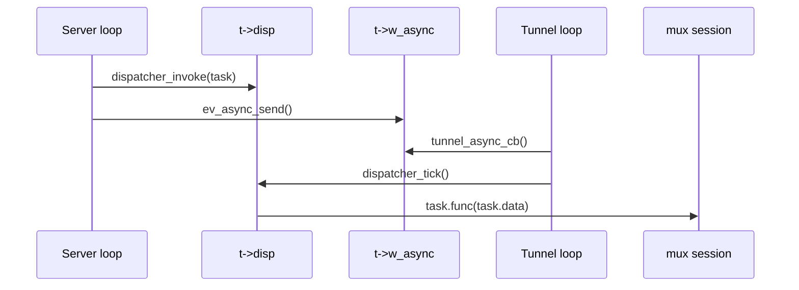

In `!WITH_THREADS`, the same ordering collapses into direct calls on the server
loop.

### 20.4 Synchronous Resume Lookup

Resume is the only cross-thread decision that cannot wait for the async relay
queue. The tunnel loop must synchronously ask the server loop whether a
matching accepted session exists in `accepted_tunnels`.

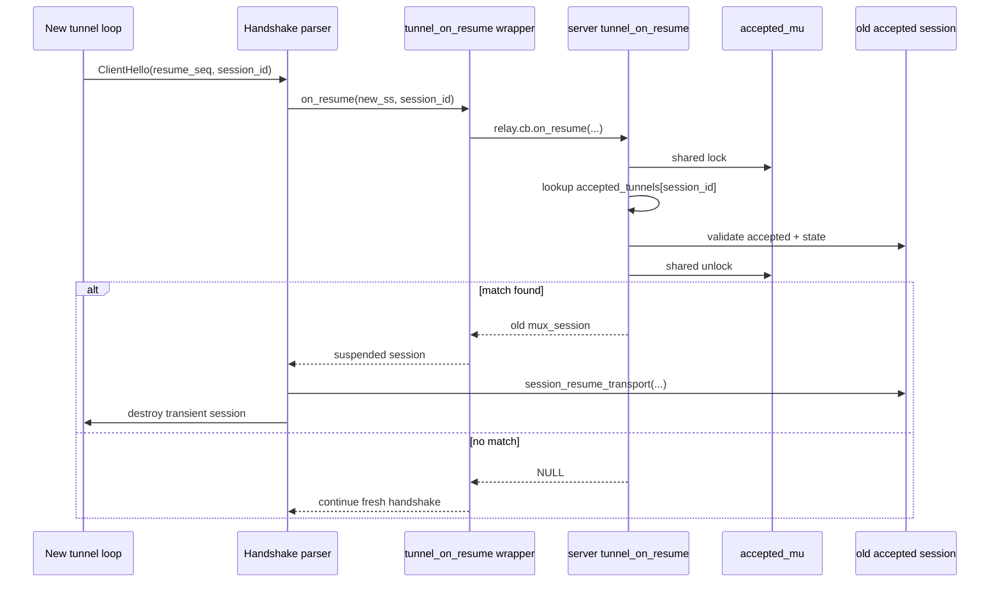

`accepted_mu` exists only for this lookup window. It protects table lifetime,
not general mux-session mutation.

### 20.5 Close Event and Final Teardown

Graceful shutdown starts from the server loop, but the actual `mux_shutdown()`
still runs on the owning tunnel loop. After `MUX_EVENT_CLOSED` is relayed back
to the server loop, `tunnel_close()` disconnects future relays, joins the
worker thread, then closes the session either on the worker or through the
server-side fallback path.

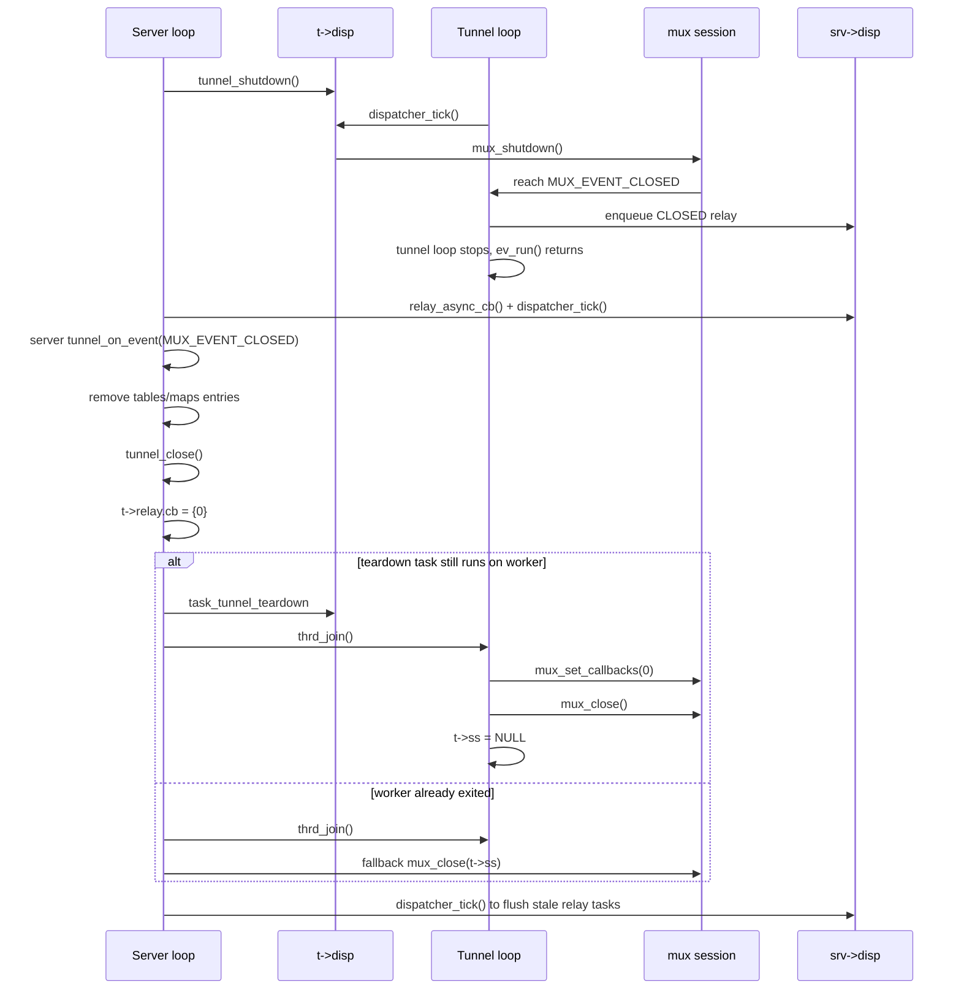

Forced stop adds one more relay-drain step before force-closing remaining
tunnels so a late `MUX_EVENT_CLOSED` cannot outlive the relay queue.

### 20.6 Practical Invariants

- Each mux session has exactly one execution loop at a time.
- All mux mutations happen on the tunnel loop, never directly on the server loop.
- Server bookkeeping stays on the server loop except for the shared-locked resume lookup.
- `accepted_mu` protects table lifetime, not general access to mux state.
- Normal event delivery is asynchronous; only resume lookup and `thrd_join()` block.

## 21. Configuration Reload

The reload sequence has a synchronous phase on the server event loop followed by an asynchronous drain-and-reconnect tail per session.

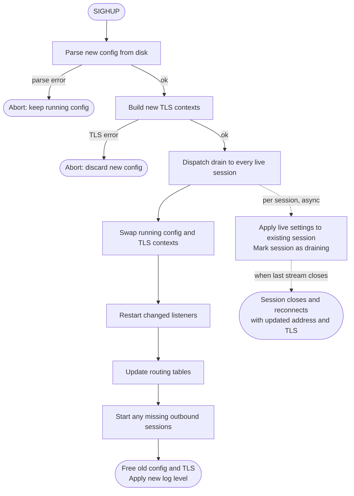

### 21.1 Synchronous Phase

The synchronous phase runs entirely on the server event loop before SIGHUP handling returns.

| Stage            | Effect                                                                                                                                                                          |
| ---------------- | ------------------------------------------------------------------------------------------------------------------------------------------------------------------------------- |
| Parse            | New config is read from disk. Any parse error aborts the reload and leaves the running config intact.                                                                           |
| TLS rebuild      | New TLS contexts are built from the new credentials. Any error aborts the reload.                                                                                               |
| Drain dispatch   | Each live session is told to drain asynchronously (see §21.2).                                                                                                                  |
| Config swap      | The new config and TLS contexts become the active ones before any listeners or sessions are created, so all subsequent accept and connect paths use the new config immediately. |
| Listener restart | Each listener whose bind address changed is stopped and restarted.                                                                                                              |
| Routing update   | The identity-peer listener table is rebuilt if the peer set changed.                                                                                                            |
| Session creation | Missing outbound sessions are started for any newly configured or previously closed slots.                                                                                      |
| Cleanup          | Old TLS contexts and config are freed; log level is updated.                                                                                                                    |

### 21.2 Drain Behavior

Each live session receives the updated settings and is marked draining before the synchronous phase completes. The following happen on the session's own loop:

- **Live settings applied immediately**: session timeouts, keepalive intervals, window sizes, `nodelay`, and memory pressure thresholds take effect for the existing session without a reconnect.
- **Outbound address updated**: the target address for reconnects is updated so the next connection attempt uses the new destination.
- **Drain armed**: the session stops admitting new inbound streams. When the last active stream closes, the session shuts down gracefully. A session already idle at drain time shuts down immediately.
- **Removed slots**: outbound sessions whose configuration slot was removed are prevented from reconnecting after they drain.

### 21.3 Asynchronous Reconnect

Once a drained session closes, the normal reconnect path (§15) re-dials using the updated address and the new TLS context from the already-swapped config. Accepted sessions do not reconnect; they are removed from the session table on close.

## 22. Shared Frame Pool

All sessions share a single frame pool owned by the server and passed to every
tunnel via a `mux_frame_allocator` pointer block. This avoids per-session
allocation overhead on the hot send path.

| Build mode      | Implementation | Notes                                                                     |
| --------------- | -------------- | ------------------------------------------------------------------------- |
| `WITH_THREADS`  | `mpmc_queue`   | Lock-free push/pop; up to 128 frames (~2 MiB) pooled across all sessions. |
| Single-threaded | `mcache`       | LRU cache; same 128-frame capacity; no atomic overhead.                   |

The `w_maintenance` timer reclaims one frame per second when the pool is above
its low-water mark, bounding idle memory retention without churning allocation.

Frame allocation on the send path can partially fail: `mux_stream_send()` chunks
the caller's buffer into frames one at a time and returns the number of bytes
actually enqueued, which may be less than requested if the pool is exhausted.
Callers must check the return value and retry or back off accordingly.
